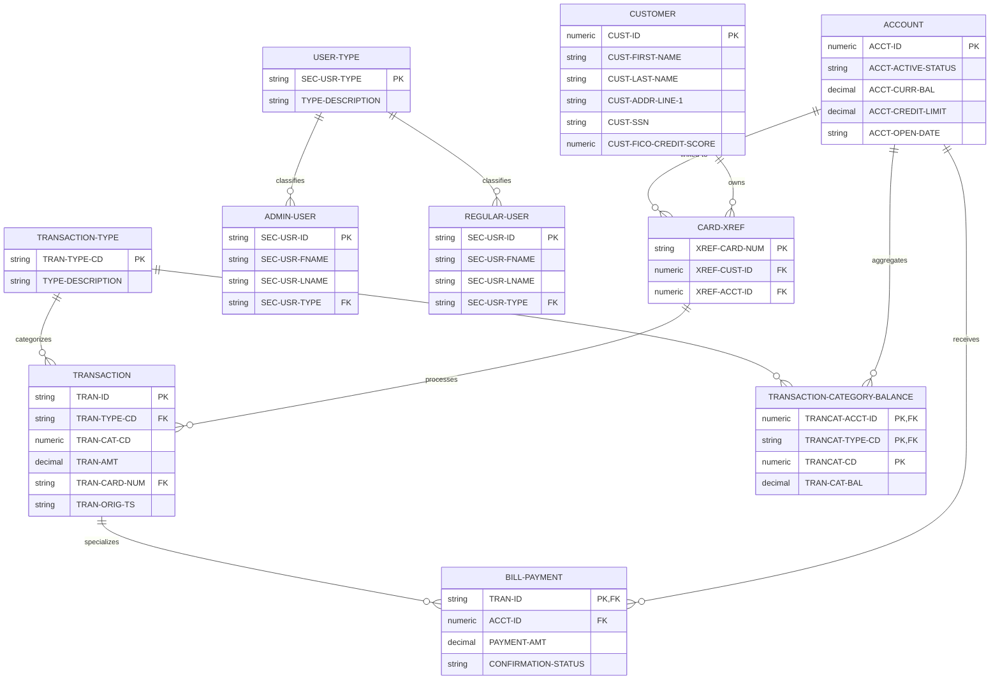

# Business Entity Analysis - CardDemo Application

## Executive Summary

This document presents a comprehensive analysis of business entities within the CardDemo COBOL application, following the Universal 5-Category Framework (Personas, Objects, Events, Metadata, Relationships). The analysis identifies 10 core business entities that represent the fundamental data structures supporting credit card management operations.

## Business Domain Context

CardDemo is a financial services application that manages credit card operations including customer management, account administration, transaction processing, and bill payment services. The system supports both administrative users and regular users with role-based access controls.

---

## Business Entity Catalog

### ENTITY-001: Admin User

**Entity Type**: Persona
**Business Domain**: User Management and Security
**Description**: Administrative personnel who manage the CardDemo system, including user administration, security oversight, and system configuration
**Source**: CSUSR01Y.cpy, lines 17-23; COADM01C.cbl, lines 1-269

**Business Attributes**:
- Primary Key: User ID (unique identifier for admin access)
- Core Attributes: First name, last name, password, user type indicator
- Foreign Keys: None (top-level entity)
- Status Fields: User type classification

**Data Structure**:
| Field Name | Data Type | Length | Description | Key Type |
|------------|-----------|---------|-------------|----------|
| SEC-USR-ID | PIC X(08) | 8 | Unique user identifier | Primary Key |
| SEC-USR-FNAME | PIC X(20) | 20 | User first name | |
| SEC-USR-LNAME | PIC X(20) | 20 | User last name | |
| SEC-USR-PWD | PIC X(08) | 8 | User password | |
| SEC-USR-TYPE | PIC X(01) | 1 | User type (A=Admin, U=User) | |

**Relationships**:
- Parent: None (independent entity)
- Children: None (manages system but doesn't own business objects)
- Associates: Regular Users (same security structure)

**Usage Context**:
- Programs: COADM01C (Admin Menu), COUSR00C (User List), COUSR01C (User Add), COUSR02C (User Update), COUSR03C (User Delete)
- Business Functions: System administration, user management, security oversight
- Business Rules: Admin users have elevated privileges for system management functions

### ENTITY-002: Regular User

**Entity Type**: Persona
**Business Domain**: User Management and Security
**Description**: Standard system users who access customer and account information with limited privileges
**Source**: CSUSR01Y.cpy, lines 17-23; COCOM01Y.cpy, lines 25-28

**Business Attributes**:
- Primary Key: User ID (unique identifier for user access)
- Core Attributes: First name, last name, password, user type indicator
- Foreign Keys: None (top-level entity)
- Status Fields: User type classification

**Data Structure**:
| Field Name | Data Type | Length | Description | Key Type |
|------------|-----------|---------|-------------|----------|
| SEC-USR-ID | PIC X(08) | 8 | Unique user identifier | Primary Key |
| SEC-USR-FNAME | PIC X(20) | 20 | User first name | |
| SEC-USR-LNAME | PIC X(20) | 20 | User last name | |
| SEC-USR-PWD | PIC X(08) | 8 | User password | |
| SEC-USR-TYPE | PIC X(01) | 1 | User type (A=Admin, U=User) | |

**Relationships**:
- Parent: None (independent entity)
- Children: None (accesses but doesn't own business objects)
- Associates: Admin Users (same security structure)

**Usage Context**:
- Programs: COUSR00C (User List), COSGN00C (Sign-on), COMEN01C (Main Menu)
- Business Functions: Customer service, account inquiry, transaction viewing
- Business Rules: Regular users have restricted access to customer and account data

### ENTITY-003: Customer

**Entity Type**: Object
**Business Domain**: Customer Relationship Management
**Description**: Individual customers who hold credit card accounts and conduct financial transactions
**Source**: CUSTREC.cpy, lines 4-23

**Business Attributes**:
- Primary Key: Customer ID (unique customer identifier)
- Core Attributes: Personal information, contact details, financial profile
- Foreign Keys: None (top-level business object)
- Status Fields: Primary card holder indicator, credit score

**Data Structure**:
| Field Name | Data Type | Length | Description | Key Type |
|------------|-----------|---------|-------------|----------|
| CUST-ID | PIC 9(09) | 9 | Unique customer identifier | Primary Key |
| CUST-FIRST-NAME | PIC X(25) | 25 | Customer first name | |
| CUST-MIDDLE-NAME | PIC X(25) | 25 | Customer middle name | |
| CUST-LAST-NAME | PIC X(25) | 25 | Customer last name | |
| CUST-ADDR-LINE-1 | PIC X(50) | 50 | Primary address line | |
| CUST-ADDR-LINE-2 | PIC X(50) | 50 | Secondary address line | |
| CUST-ADDR-LINE-3 | PIC X(50) | 50 | Additional address line | |
| CUST-ADDR-STATE-CD | PIC X(02) | 2 | State code | |
| CUST-ADDR-COUNTRY-CD | PIC X(03) | 3 | Country code | |
| CUST-ADDR-ZIP | PIC X(10) | 10 | ZIP/postal code | |
| CUST-PHONE-NUM-1 | PIC X(15) | 15 | Primary phone number | |
| CUST-PHONE-NUM-2 | PIC X(15) | 15 | Secondary phone number | |
| CUST-SSN | PIC 9(09) | 9 | Social Security Number | |
| CUST-GOVT-ISSUED-ID | PIC X(20) | 20 | Government issued ID | |
| CUST-DOB-YYYYMMDD | PIC X(10) | 10 | Date of birth | |
| CUST-EFT-ACCOUNT-ID | PIC X(10) | 10 | Electronic funds transfer account | |
| CUST-PRI-CARD-HOLDER-IND | PIC X(01) | 1 | Primary card holder indicator | |
| CUST-FICO-CREDIT-SCORE | PIC 9(03) | 3 | FICO credit score | |

**Relationships**:
- Parent: None (top-level business entity)
- Children: Accounts (1:N relationship)
  - Linked via: CUST-ID → XREF-CUST-ID (through Card Cross-Reference)
- Associates: Card Cross-Reference (links to cards and accounts)

**Usage Context**:
- Programs: Customer management programs, account opening processes
- Business Functions: Customer onboarding, profile management, credit assessment
- Business Rules: Each customer must have unique ID, credit score affects account limits

### ENTITY-004: Account

**Entity Type**: Object
**Business Domain**: Account Management and Credit Services
**Description**: Credit card accounts that hold balances, credit limits, and transaction history for customers
**Source**: CVACT01Y.cpy, lines 4-17

**Business Attributes**:
- Primary Key: Account ID (unique account identifier)
- Core Attributes: Balance information, credit limits, account dates
- Foreign Keys: Links to customers through Card Cross-Reference
- Status Fields: Active status, expiration dates

**Data Structure**:
| Field Name | Data Type | Length | Description | Key Type |
|------------|-----------|---------|-------------|----------|
| ACCT-ID | PIC 9(11) | 11 | Unique account identifier | Primary Key |
| ACCT-ACTIVE-STATUS | PIC X(01) | 1 | Account active status | |
| ACCT-CURR-BAL | PIC S9(10)V99 | 12 | Current account balance | |
| ACCT-CREDIT-LIMIT | PIC S9(10)V99 | 12 | Credit limit | |
| ACCT-CASH-CREDIT-LIMIT | PIC S9(10)V99 | 12 | Cash advance credit limit | |
| ACCT-OPEN-DATE | PIC X(10) | 10 | Account opening date | |
| ACCT-EXPIRAION-DATE | PIC X(10) | 10 | Account expiration date | |
| ACCT-REISSUE-DATE | PIC X(10) | 10 | Card reissue date | |
| ACCT-CURR-CYC-CREDIT | PIC S9(10)V99 | 12 | Current cycle credits | |
| ACCT-CURR-CYC-DEBIT | PIC S9(10)V99 | 12 | Current cycle debits | |
| ACCT-ADDR-ZIP | PIC X(10) | 10 | Account address ZIP code | |
| ACCT-GROUP-ID | PIC X(10) | 10 | Account group identifier | |

**Relationships**:
- Parent: Customer (N:1 relationship)
  - Linked via: XREF-ACCT-ID → ACCT-ID
- Children: Transactions (1:N relationship), Transaction Category Balances (1:N relationship)
  - Linked via: ACCT-ID → TRANCAT-ACCT-ID
- Associates: Card Cross-Reference (links to customers and cards)

**Usage Context**:
- Programs: COBIL00C (Bill Payment), Account management programs
- Business Functions: Credit management, balance tracking, payment processing
- Business Rules: Account balance cannot exceed credit limit, active status controls usage

### ENTITY-005: Transaction

**Entity Type**: Event
**Business Domain**: Transaction Processing and Payment Services
**Description**: Individual financial transactions including purchases, payments, and other account activities
**Source**: CVTRA05Y.cpy, lines 4-18

**Business Attributes**:
- Primary Key: Transaction ID (unique transaction identifier)
- Core Attributes: Transaction details, amounts, merchant information, timestamps
- Foreign Keys: Card number linking to accounts
- Status Fields: Transaction type and category codes

**Data Structure**:
| Field Name | Data Type | Length | Description | Key Type |
|------------|-----------|---------|-------------|----------|
| TRAN-ID | PIC X(16) | 16 | Unique transaction identifier | Primary Key |
| TRAN-TYPE-CD | PIC X(02) | 2 | Transaction type code | |
| TRAN-CAT-CD | PIC 9(04) | 4 | Transaction category code | |
| TRAN-SOURCE | PIC X(10) | 10 | Transaction source | |
| TRAN-DESC | PIC X(100) | 100 | Transaction description | |
| TRAN-AMT | PIC S9(09)V99 | 11 | Transaction amount | |
| TRAN-MERCHANT-ID | PIC 9(09) | 9 | Merchant identifier | |
| TRAN-MERCHANT-NAME | PIC X(50) | 50 | Merchant name | |
| TRAN-MERCHANT-CITY | PIC X(50) | 50 | Merchant city | |
| TRAN-MERCHANT-ZIP | PIC X(10) | 10 | Merchant ZIP code | |
| TRAN-CARD-NUM | PIC X(16) | 16 | Card number | Foreign Key |
| TRAN-ORIG-TS | PIC X(26) | 26 | Original timestamp | |
| TRAN-PROC-TS | PIC X(26) | 26 | Processing timestamp | |

**Relationships**:
- Parent: Account (N:1 relationship through card number)
  - Linked via: TRAN-CARD-NUM → XREF-CARD-NUM → XREF-ACCT-ID
- Children: None (atomic business event)
- Associates: Transaction Category Balance (affects category totals)

**Usage Context**:
- Programs: COTRN01C (Transaction View), COTRN00C (Transaction List), COBIL00C (Bill Payment)
- Business Functions: Purchase processing, payment recording, transaction history
- Business Rules: All transactions must have valid card numbers, amounts affect account balances

### ENTITY-006: Bill Payment

**Entity Type**: Event
**Business Domain**: Payment Processing and Account Management
**Description**: Specific type of transaction representing customer payments toward account balances
**Source**: COBIL00C.cbl, lines 210-244

**Business Attributes**:
- Primary Key: Transaction ID (inherits from Transaction structure)
- Core Attributes: Payment amount, confirmation status, processing timestamps
- Foreign Keys: Account ID for payment target
- Status Fields: Confirmation flag, payment processing status

**Data Structure**:
| Field Name | Data Type | Length | Description | Key Type |
|------------|-----------|---------|-------------|----------|
| TRAN-ID | PIC X(16) | 16 | Unique transaction identifier | Primary Key |
| TRAN-TYPE-CD | PIC X(02) | 2 | Transaction type ('02' for payments) | |
| TRAN-CAT-CD | PIC 9(04) | 4 | Transaction category (2 for payments) | |
| TRAN-SOURCE | PIC X(10) | 10 | Payment source ('POS TERM') | |
| TRAN-DESC | PIC X(100) | 100 | Payment description | |
| TRAN-AMT | PIC S9(09)V99 | 11 | Payment amount | |
| TRAN-CARD-NUM | PIC X(16) | 16 | Card number | Foreign Key |
| ACCT-ID | PIC 9(11) | 11 | Account being paid | Foreign Key |

**Relationships**:
- Parent: Account (N:1 relationship)
  - Linked via: ACCT-ID → ACCT-ID
- Children: None (atomic business event)
- Associates: Transaction (specialized type of transaction)

**Usage Context**:
- Programs: COBIL00C (Bill Payment Processing)
- Business Functions: Account balance reduction, payment confirmation, transaction recording
- Business Rules: Payment amount cannot exceed current balance, requires user confirmation

### ENTITY-007: Transaction Category Balance

**Entity Type**: Object
**Business Domain**: Financial Reporting and Category Management
**Description**: Aggregated balance information for specific transaction categories within accounts
**Source**: CVTRA01Y.cpy, lines 4-10

**Business Attributes**:
- Primary Key: Composite key (Account ID + Type Code + Category Code)
- Core Attributes: Category balance amount
- Foreign Keys: Account ID linking to accounts
- Status Fields: Category type and code classifications

**Data Structure**:
| Field Name | Data Type | Length | Description | Key Type |
|------------|-----------|---------|-------------|----------|
| TRANCAT-ACCT-ID | PIC 9(11) | 11 | Account identifier | Primary Key |
| TRANCAT-TYPE-CD | PIC X(02) | 2 | Transaction type code | Primary Key |
| TRANCAT-CD | PIC 9(04) | 4 | Transaction category code | Primary Key |
| TRAN-CAT-BAL | PIC S9(09)V99 | 11 | Category balance amount | |

**Relationships**:
- Parent: Account (N:1 relationship)
  - Linked via: TRANCAT-ACCT-ID → ACCT-ID
- Children: None (aggregated data object)
- Associates: Transactions (aggregates transaction amounts by category)

**Usage Context**:
- Programs: Reporting programs, balance inquiry functions
- Business Functions: Category-based spending analysis, financial reporting, budget tracking
- Business Rules: Balances must reconcile with underlying transaction amounts

### ENTITY-008: Card Cross-Reference

**Entity Type**: Relationship
**Business Domain**: Account and Customer Linkage
**Description**: Junction entity that links customers, accounts, and card numbers in many-to-many relationships
**Source**: CVACT03Y.cpy, lines 4-8

**Business Attributes**:
- Primary Key: Card Number (unique card identifier)
- Core Attributes: Customer ID, Account ID linkages
- Foreign Keys: Customer ID, Account ID
- Status Fields: None (pure relationship entity)

**Data Structure**:
| Field Name | Data Type | Length | Description | Key Type |
|------------|-----------|---------|-------------|----------|
| XREF-CARD-NUM | PIC X(16) | 16 | Card number | Primary Key |
| XREF-CUST-ID | PIC 9(09) | 9 | Customer identifier | Foreign Key |
| XREF-ACCT-ID | PIC 9(11) | 11 | Account identifier | Foreign Key |

**Relationships**:
- Parent: Customer (N:1 relationship), Account (N:1 relationship)
  - Linked via: XREF-CUST-ID → CUST-ID
  - Linked via: XREF-ACCT-ID → ACCT-ID
- Children: None (relationship entity)
- Associates: Transactions (provides card-to-account linkage)

**Usage Context**:
- Programs: COBIL00C (Bill Payment), account lookup functions
- Business Functions: Customer-account association, card-account mapping, transaction routing
- Business Rules: Each card must be associated with exactly one customer and one account

### ENTITY-009: User Type

**Entity Type**: Metadata
**Business Domain**: Security and Access Control
**Description**: Classification system that defines user roles and access privileges within the system
**Source**: CSUSR01Y.cpy, line 22; COCOM01Y.cpy, lines 26-28

**Business Attributes**:
- Primary Key: User Type Code (single character classification)
- Core Attributes: Type description and privilege level
- Foreign Keys: None (classification metadata)
- Status Fields: Active/inactive status for type

**Data Structure**:
| Field Name | Data Type | Length | Description | Key Type |
|------------|-----------|---------|-------------|----------|
| SEC-USR-TYPE | PIC X(01) | 1 | User type code (A/U) | Primary Key |

**Relationships**:
- Parent: None (metadata classification)
- Children: Admin Users, Regular Users (1:N relationship)
  - Linked via: SEC-USR-TYPE → SEC-USR-TYPE
- Associates: None (classification metadata)

**Usage Context**:
- Programs: COSGN00C (Sign-on), COADM01C (Admin Menu), security validation routines
- Business Functions: Access control, privilege management, security enforcement
- Business Rules: 'A' = Admin privileges, 'U' = User privileges, determines menu options and access rights

### ENTITY-010: Transaction Type

**Entity Type**: Metadata
**Business Domain**: Transaction Classification and Processing
**Description**: Classification system that categorizes different types of financial transactions for processing and reporting
**Source**: CVTRA05Y.cpy, line 6; COBIL00C.cbl, line 220

**Business Attributes**:
- Primary Key: Transaction Type Code (two-character classification)
- Core Attributes: Type description and processing rules
- Foreign Keys: None (classification metadata)
- Status Fields: Active/inactive status for type

**Data Structure**:
| Field Name | Data Type | Length | Description | Key Type |
|------------|-----------|---------|-------------|----------|
| TRAN-TYPE-CD | PIC X(02) | 2 | Transaction type code | Primary Key |

**Relationships**:
- Parent: None (metadata classification)
- Children: Transactions (1:N relationship), Transaction Category Balances (1:N relationship)
  - Linked via: TRAN-TYPE-CD → TRAN-TYPE-CD
  - Linked via: TRAN-TYPE-CD → TRANCAT-TYPE-CD
- Associates: None (classification metadata)

**Usage Context**:
- Programs: COTRN01C (Transaction View), COBIL00C (Bill Payment), transaction processing routines
- Business Functions: Transaction categorization, processing rule application, financial reporting
- Business Rules: '02' = Payment transactions, different codes trigger different processing logic

---

## Combined Entity Relationship

---

## Summary

This analysis identified 10 core business entities across the CardDemo application using the Universal 5-Category Framework:

- **2 Personas**: Admin User, Regular User
- **4 Objects**: Customer, Account, Transaction Category Balance, Bill Payment
- **2 Events**: Transaction, Bill Payment (specialized transaction)
- **2 Metadata**: User Type, Transaction Type  
- **1 Relationship**: Card Cross-Reference

The entities support a comprehensive credit card management system with clear separation of concerns between user management, customer data, account operations, and transaction processing. All entities have been validated against the business recognition criteria and represent concepts that business stakeholders would recognize and care about managing.

Key architectural patterns identified:
- Customer-centric design with accounts linked through card cross-references
- Event-driven transaction processing with category-based aggregation
- Role-based security with distinct admin and user personas
- Metadata-driven classification for extensible transaction and user type management

The entity relationships support complex business scenarios including multiple cards per customer, category-based spending analysis, and specialized payment processing workflows.
